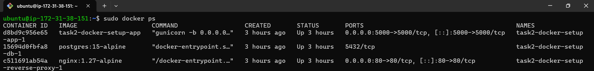
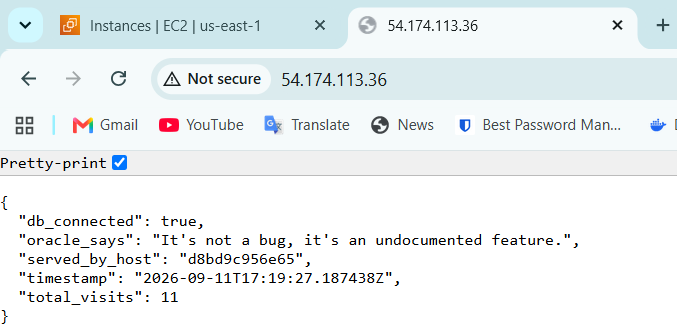
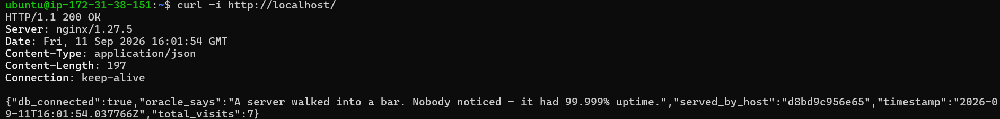
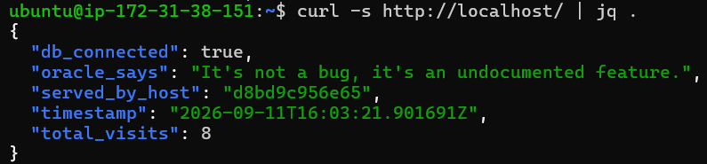
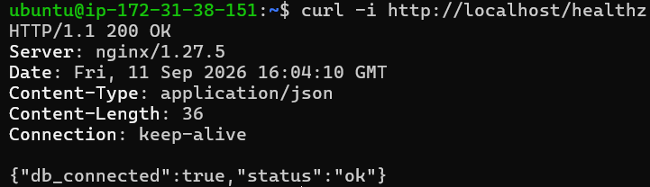
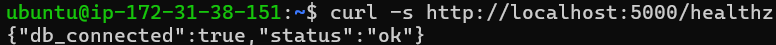

# Task 2: Containerization & Web Services

## Overview

This task covers the design, containerization, and orchestration of a multi-tier web application stack using **Docker** and **Docker Compose**. 

The architecture consists of three interconnected services running on an isolated bridge network:
1. **Reverse Proxy (`reverse-proxy`)**: An Nginx web server acting as the front-facing entry point on port `80`, routing client requests to the backend application.
2. **Backend Application (`app`)**: A Python 3.12 Flask application running under the production WSGI server **Gunicorn** on port `5000`. It serves an Oracle Quote API, logs visitor records to the database, and provides a health check endpoint.
3. **Database (`db`)**: A PostgreSQL 15 database service with persistent data storage backed by a Docker named volume (`db_data`).

---

## Environment

- **Platform:** AWS EC2 / Local Linux / Windows Docker Host
- **OS:** Ubuntu 26.04 (Resolute)
- **Container Engine:** Docker Engine (v24.0+) / Docker Compose v2 (Compose Plugin)
- **Base Images:**
  - `python:3.12-slim-bookworm` (Application)
  - `nginx:1.27-alpine` (Reverse Proxy)
  - `postgres:15-alpine` (Database)

---

### Component Details

- **`Dockerfile`**: Uses a lightweight Debian Bookworm-based Python runtime. Installs dependencies without caching wheels, copies application code, exposes port `5000`, and starts Gunicorn with 2 worker processes.
- **`app.py`**:
  - `GET /`: Returns a random tech quote, container hostname, timestamp, whether DB is connected, and total visits count stored in PostgreSQL.
  - `GET /healthz`: Health check endpoint returning HTTP 200 (`status: ok`) when DB is reachable, or HTTP 503 (`status: degraded`) when unreachable.
  - Database initialization (`init_db`) runs automatically and creates a `visits` table if it does not exist.
- **`requirements.txt`**: Pins dependencies to stable versions (`Flask==3.0.3`, `psycopg2-binary==2.9.9`, `gunicorn==22.0.0`).
- **`docker-compose.yaml`**: Coordinates build parameters, port forwardings (`80:80`, `5000:5000`), container dependencies (`depends_on`), environment variables, and the `db_data` volume.
- **`nginx/nginx.conf`**: Configures Nginx to listen on port 80 and forward incoming requests to `http://app:5000` along with essential proxy headers (`Host`, `X-Real-IP`, `X-Forwarded-For`, `X-Forwarded-Proto`).

---

## Step-by-Step Instructions

### Step 1: Install Docker & Docker Compose

If Docker is not already installed on the host (e.g. AWS Ubuntu EC2), run:

```bash
# Add Docker's official GPG key:
sudo apt update
sudo apt install ca-certificates curl
sudo install -m 0755 -d /etc/apt/keyrings
sudo curl -fsSL https://download.docker.com/linux/ubuntu/gpg -o /etc/apt/keyrings/docker.asc
sudo chmod a+r /etc/apt/keyrings/docker.asc

# Add the repository to Apt sources:
sudo tee /etc/apt/sources.list.d/docker.sources <<EOF
Types: deb
URIs: https://download.docker.com/linux/ubuntu
Suites: $(. /etc/os-release && echo "${UBUNTU_CODENAME:-$VERSION_CODENAME}")
Components: stable
Architectures: $(dpkg --print-architecture)
Signed-By: /etc/apt/keyrings/docker.asc
EOF

sudo apt update

sudo apt install docker-ce docker-ce-cli containerd.io docker-buildx-plugin docker-compose-plugin

# Allow non-root user (e.g. trainee) to run Docker
sudo usermod -aG docker $USER
```

Verify Docker installation:
```bash
docker --version
docker compose version
```

---

### Step 2: Navigate to Project Directory

Clone or navigate into the task folder:

```bash
cd task2-docker-setup
```

Ensure all files (`Dockerfile`, `app.py`, `docker-compose.yaml`, `requirements.txt`, and `nginx/nginx.conf`) are present:

```bash
ls -la
ls -la nginx/
```

---

### Step 3: Verify Nginx Reverse Proxy Configuration

Open `nginx/nginx.conf` and ensure that `proxy_pass` targets the Docker Compose service name `app`:

```nginx
server {
    listen 80;
    server_name _;

    location / {
        proxy_pass http://app:5000;
        proxy_set_header Host $host;
        proxy_set_header X-Real-IP $remote_addr;
        proxy_set_header X-Forwarded-For $proxy_add_x_forwarded_for;
        proxy_set_header X-Forwarded-Proto $scheme;
    }
}
```


---

### Step 4: Build and Start Containers

Launch the entire stack in detached mode (`-d`):

```bash
docker compose up -d --build
```

This command will:
1. Build the Flask application Docker image using `Dockerfile`.
2. Pull `postgres:15-alpine` and `nginx:1.27-alpine` images.
3. Create the default bridge network.
4. Create the named volume `db_data`.
5. Start the containers in dependency order (`db` first, then `app`, then `reverse-proxy`).

---

### Step 5: Check Container Status & Logs

Check that all three containers are in the `Up` state:

```bash
docker compose ps
```


Inspect service startup logs:
```bash
docker compose logs -f
```

---

## Verification & Testing

### 1. Browser output accessing the reverse-proxied application


### 2. Test Application via Nginx Reverse Proxy (Port 80)

Send an HTTP GET request to port 80:

```bash
curl -i http://localhost/
```


Run the request again to verify the visitor counter increments:

```bash
curl -s http://localhost/ | jq .
```

---

### 3. Test Health Check Endpoint (`/healthz`)

Check the health status of the application and its database connectivity:

```bash
curl -i http://localhost/healthz
```

---

### 4. Verify Direct Backend Access (Port 5000)

Verify direct connectivity to the Gunicorn WSGI server bypassing Nginx:

```bash
curl -s http://localhost:5000/healthz
```


### Teardown

Stop and remove all containers, networks, and the database volume:

    cd task2-docker-setup
    docker compose down -v

**Note:** the `-v` flag also deletes the `db_data` volume — meaning all
database contents are permanently removed. Only use `-v` for a full,
clean teardown.

    docker compose down

Verify everything is stopped:

    docker ps -a

Confirm the volume was removed (only relevant if you used `-v`):

    docker volume ls

## Issues Encountered & Resolutions
### 1. 502 Bad Gateway from Nginx
**Error:** `curl localhost` returned a 502. Nginx error log showed:
```
connect() failed (111: Connection refused) while connecting to upstream,
upstream: "http://127.0.0.1:5000/"
```
**Cause:** `nginx.conf` had `proxy_pass http://localhost:5000;`. Inside a
container, `localhost` always refers to that container itself never a
different container. The Flask app runs in a completely separate container
with its own network namespace, so nginx was trying to reach port 5000 on
itself, where nothing is listening.

**Resolution:** Changed to `proxy_pass http://app:5000;`, using the Docker
Compose service name instead. Docker Compose provides automatic internal DNS
that resolves service names to the correct container's internal IP within
the shared network. Restarted the reverse-proxy container to pick up the
corrected config and confirmed with `docker exec ... cat /etc/nginx/conf.d/default.conf`.

---
### 2. `permission denied` connecting to Docker daemon
**Error:**
```
permission denied while trying to connect to the docker API at unix:///var/run/docker.sock
```
**Cause:** The `ubuntu` user wasn't part of the `docker` group, so it lacked
permission to talk to the Docker socket without `sudo`.

**Resolution:**
```bash
sudo usermod -aG docker $USER
```
Logged out and back in for the group membership to take effect. After this,
`docker` commands worked without `sudo`.
