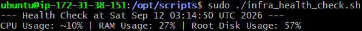
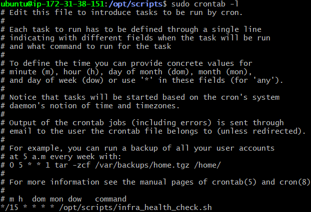

## Task 3 — Automation & Shell Scripting

`scripts/infra_health_check.sh` monitors system health and alerts on problems.

**What it checks:**
- CPU, RAM, and root disk usage
- Whether the Docker service is running
- Whether the app container (`task2-docker-setup-app-1`) is running

**Alerting:** If root disk usage exceeds 85% or the app container isn't
running, the script prints a `[WARNING]` message to the terminal and appends
a timestamped entry to `/var/log/infra_health.log`.

### Deployment

    sudo cp scripts/infra_health_check.sh /opt/scripts/infra_health_check.sh
    sudo chmod +x /opt/scripts/infra_health_check.sh

### Manual test

    sudo /opt/scripts/infra_health_check.sh
    cat /var/log/infra_health.log

To confirm the warning path actually fires (not just the healthy path):

    docker stop task2-docker-setup-app-1
    sudo /opt/scripts/infra_health_check.sh
    cat /var/log/infra_health.log
    docker start task2-docker-setup-app-1

### Cron job

Registered directly via `crontab -e` (run as root, since the script needs
Docker access that may not be available to non-root cron jobs):

    sudo crontab -e

Entry added:

    */15 * * * * /opt/scripts/infra_health_check.sh

Verify it's registered:

    sudo crontab -l

### Verification

