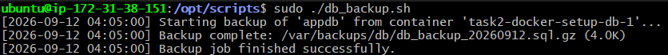
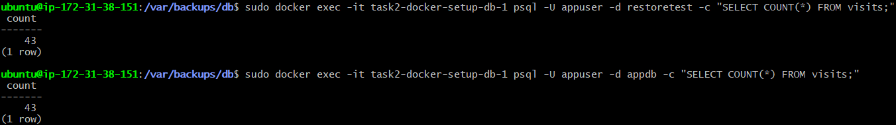

# Task 4 — Monitoring, Backups & Disaster Recovery

## Database Backup

`scripts/db_backup.sh` dumps the PostgreSQL database from the running
`task2-docker-setup-db-1` container using `pg_dump`, compresses it with
gzip, and stores it as `db_backup_YYYYMMDD.sql.gz` in `/var/backups/db/`.
Backups older than 7 days are automatically pruned.

**Note on compression format:** the assignment text mentions ".tar.gz" in
one place but gives the explicit required filename as
`db_backup_YYYYMMDD.sql.gz`. This script follows the explicit filename
format (plain gzip on the SQL dump) since it's the more specific
instruction.

### Deployment
```bash
sudo nano /opt/scripts/db_backup.sh
sudo chmod +x /opt/scripts/db_backup.sh
```
### Manual run
```bash
sudo /opt/scripts/db_backup.sh
ls -lh /var/backups/db/
```


## Restore Procedure

To restore the database from a backup archive:
```bash
    # 1. Decompress the backup
    gunzip -k /var/backups/db/db_backup_YYYYMMDD.sql.gz

    # 2. Copy the SQL file into the running db container
    docker cp /var/backups/db/db_backup_YYYYMMDD.sql task2-docker-setup-db-1:/tmp/restore.sql
    # 4. I am restoring into a fresh/empty database, create it first:
    docker exec -it task2-docker-setup-db-1 createdb -U appuser appdb
    # 3. Restore into the database
    docker exec -it task2-docker-setup-db-1 psql -U appuser -d appdb -f /tmp/restore.sql

    
```
### Verification performed

Restore was tested end-to-end against a separate test database
(`restoretest`) rather than overwriting live data, to safely confirm the
procedure without risking the running app's connectivity:
```bash
    docker exec -it task2-docker-setup-db-1 createdb -U appuser restoretest
    docker exec -it task2-docker-setup-db-1 psql -U appuser -d restoretest -f /tmp/restore_test.sql
    docker exec -it task2-docker-setup-db-1 psql -U appuser -d restoretest -c "SELECT COUNT(*) FROM visits;"
```
Confirmed the `visits` table and row count matched the source database,
proving the backup archive is a valid, restorable dump. Test database was
dropped afterward to avoid leaving unused artifacts on the server.

